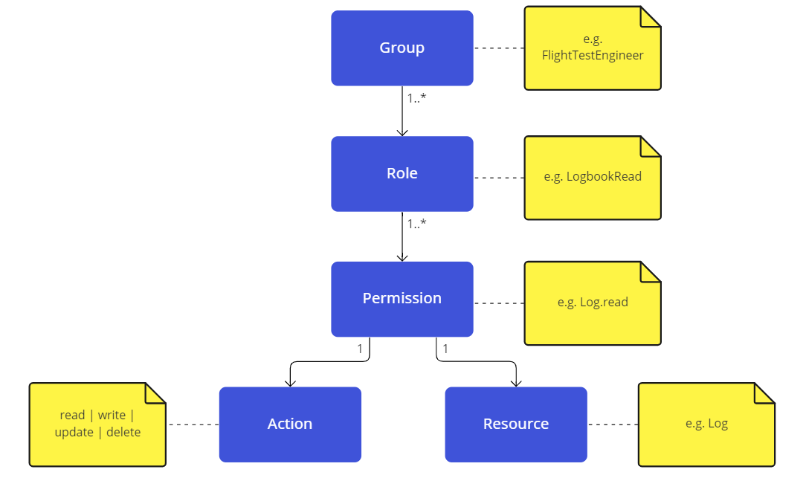

# Auth Library

In order to leverage authentication and authorization in your application, please add `@voloiq/auth` as a dependency to your package.
With the dependency in place, you can wrap your application in the `AuthenticationProvider` which will handle authentication and authorization automatically.
After the user is logged in, you can use the `isAuthorizedTo` and `<RequirePermissions ... />` APIs to protect UI components under a set of specific permissions.

## Environment

The authConfiguration json can be passed as a prop to the AuthenticationProvider. As the authentication is only used in production, there is no need to pass it for the local dev setup. The local dev setup uses the LocalAuthenticationProvider which is mocking Azure AD.

## Example

```tsx
// ...
import { AuthenticationProvider, isAuthorizedTo } from "@voloiq/auth";

export const Router = () => {
    const canReadLogbookLogs = isAuthorizedTo(["read"], ["Log"]);

    <Routes>
        <Route path="/" element={<AppLayout />}>
            <Route path="" element={<Home />} />
            {flags.logbook && canReadLogbookLogs && <Route path="logbook/*" element={<Logbook />} />}
        </Route>
    </Routes>;
};

export const App = () => (
    <AuthenticationProvider>
        <Router />
    </AuthenticationProvider>
);
```

## Testing

The easier option for testing is to use the `LocalAuthenticationProvider` provider: the user will have all permissions (`*`) by default.

To make it easier for developers, the `render` API exposed by the `@voloiq/testing` library automatically wraps a `LocalAuthenticationProvider` during testing, and accepts an optional parameter (in the third position) to partially override the value of the permissions:

```tsx
// ...
import { render } from "@voloiq/testing";

test("The logbook menu shows correctly with the log read permission", () => {
    render(<VoloIqNavigationBar />);

    expect(screen.getByText("Logbook")).toBeVisible();
});

test("The logbook menu item does not show when the log read permission is missing", () => {
    render(<VoloIqNavigationBar />, undefined, []);

    expect(screen.queryByText("Logbook")).not.toBeInTheDocument();
});
```

## Authorization model



## Group mapping

We want to have a loose coupling between VoloIQ groups (e.g. Flight Test Engineer) and the Identity Provider (IDP, e.g. Azure AD) groups (e.g. VOLOIQ Contributor). Therefore, a mapping is done between the two.
The mapping is configured via the environment variable within the `mapping` property. This environment variable is only needed for production and can be found in the [deployment configurations](https://dev.azure.com/volocopter/devops/_git/devops-voloiq-services-appconfig?path=/configuration2/apps/voloiq-ui.yml&version=GBmain&line=55&lineEnd=56&lineStartColumn=1&lineEndColumn=1&lineStyle=plain&_a=contents).

Notice that each environment brings its own configuration, as IDP groups might have different authorizations on different environments. The target group and its role and permissions should be defined in the authorization.ts file (see the next section).  
  
Roles are just a way to better organize permissions and be more flexible. A group can (and probably should) have multiple roles.

## Modifying groups, roles, permissions and resources

1. [Document the change in Confluence](https://confluence.volocopter.org/pages/viewpage.action?pageId=134414417)
2. Update the [authorization.ts](./src/authorization/authorization.ts) file

    Only applicable when modifying groups:

3. Update the mapping of each environment configuration in the [voloiq-ui.yml](https://dev.azure.com/volocopter/devops/_git/devops-voloiq-services-appconfig?path=/configuration2/apps/voloiq-ui.yml) repo
4. Contact your closest DevOps to assign groups to users on Azure if necessary

## Testing with a specific group locally

Locally, you can open the [LocalAuthenticationProvider](./src/authentication/LocalAuthenticationProvider.tsx) file which is the provider that is used when running the dev server locally and replace `"Admin"` by another group of your choosing.

## Testing locally with an Azure AD instance

In order to test auth related changes in a realistic environment, you can use Azure AD locally instead of the mocked Azure AD provider used by default.

1. Edit `AppShell.tsx` to use the `AuthenticationProvider` locally:

```diff
-      Wrapper={isProduction ? AuthenticationProvider : LocalAuthenticationProvider}
+      Wrapper={isProduction ? AuthenticationProvider : AuthenticationProvider}
```

2. Edit `AppShell.tsx` to provide an auth configuration that uses the Azure AD sandbox:

```diff
-      <ConditionalWrapper
-            Wrapper={isProduction ? AuthenticationProvider : AuthenticationProvider}
-            wrapperProps={isProduction ? { authConfiguration } : { permissions: localAuthorizationConfiguration }}
-            condition={withAuth}
-        >
+      <ConditionalWrapper
+            Wrapper={isProduction ? AuthenticationProvider : AuthenticationProvider}
+            wrapperProps={
+                isProduction
+                    ? { authConfiguration }
+                    : {
+                          authConfiguration: {
+                              domain: "localhost:9000",
+                              type: "msal",
+                              authorization: {
+                                  mapping: [
+                                      {
+                                          sourceId: "admin",
+                                          targetGroupName: "Admin",
+                                      },
+                                  ],
+                              },
+                              verificationInfo: {
+                                  clientId: "856ab903-e37d-41ed-bba0-427f6250a27d",
+                                  authority: "https://login.microsoftonline.com/3fd2cab1-f540-48f1-b76d-55f4d472c837",
+                                  redirectUri: "http://localhost:9000",
+                              },
+                          },
+                      }
+            }
+            condition={withAuth}
+        >
```

3. With the previous auth configuration, only the admin group is configured. For this group to be correctly recognized for your user, change the `MsalProvider.tsx` file to mock the groups returned by Azure AD as if your user had the admin group (this is the only option because Access Packages are not available for the sandbox):

```diff
-      groups: (account.idTokenClaims?.roles as string[]) || [],
+      groups: ["admin"],
```
