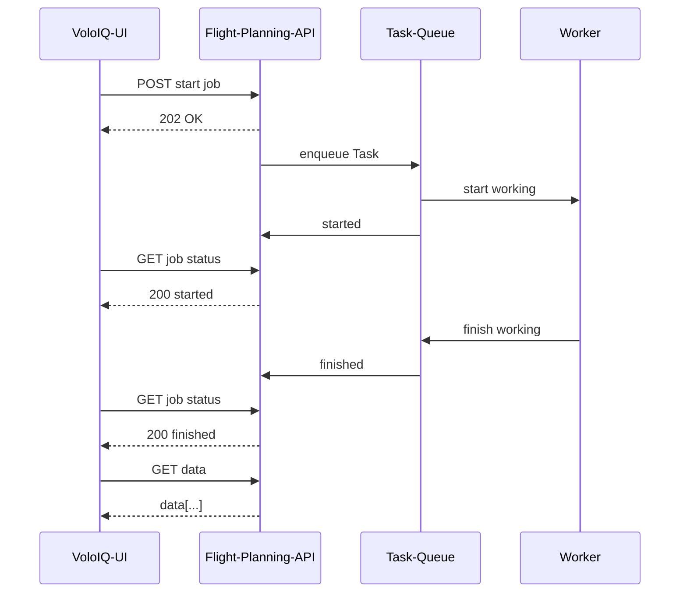

# Job Queue Hook

The job queue hook is a React Hook to make use of our current job queue implementation.

Our job implementation follows the Microsoft Pattern for asynchronous request reply: https://learn.microsoft.com/en-us/azure/architecture/patterns/async-request-reply



**Sequence:**

1. Client starts a new job by calling an endpoint via POST
2. Client receives from backend http code 202 with Header fields `Retry-After` that indicates the interval in seconds to check if the job is already done and an URL in `Location` to check for the job status.
3. Client waits until the interval is reached and retries
4. If the job is done, the client can fetch now the available data via the same URL as the job was started with.

## Hook

You can just import the `useJobQueue` hook and provide a _startJobUrl_. The hook takes automatically care of starting the job, toggles via interval the job status and provides the resourceUrl when the job is done.

```ts
const { isSuccess, isFetching } = useJobQueue({
    startJobUrl: url,
    jobKey: [{ routeId }, "full-energy-calculation"],
    dependentQueryKey: queryKey,
});
```

## Example

The job queue hook provides the resourceUrl when its done. This URL can now be used to fetch the data.

> **Attention:** Keep in mind to only enable the useQuery hook if the job is done and the url available. The url also needs to be part of the queryKey, otherwise the resourceUrl will always be none for the query.

```ts
export const useGetRouteFullEnergy = (routeId: string | number) => {
    const { axiosInstance, baseUrl } = useService();
    const url = `${baseUrl}/routes/${routeId}/energy`;
    const queryKey = ["routes", { routeId },"energy", "fullEnergy"];

    const { isSuccess, isFetching } = useJobQueue({
        startJobUrl: url,
        jobKey: ["routes", { routeId },"full-energy-calculation"],
        dependentQueryKey: queryKey,
    });

    const query = useQuery({
        queryKey,
        enabled: isSuccess,
        queryFn: async () => {
            const { data } = await axiosInstance.get<ResponseEnvelope<RouteFullEnergy>>(url, {
                paramsSerializer,
                withCredentials: true,
            });
            return data.data;
        },
        staleTime: 1000 * 60 * 20, // refetch after 20min or manually invalidation
    });

    return {
        ...query,
        isFetching: isFetching || query.isFetching,
    };
};
```
